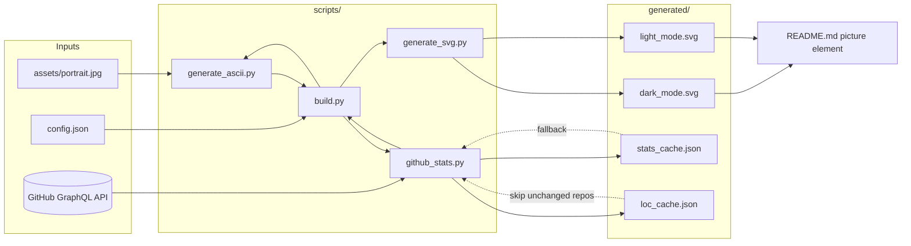
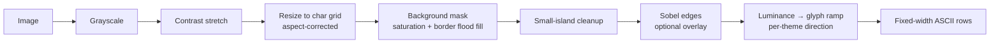
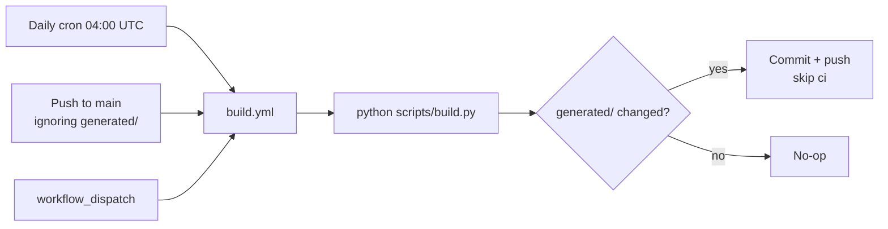

# Architecture

Five small, typed Python modules; `scripts/build.py` is the only
composer. No templates — both SVGs are generated from scratch each run.

## Image → ASCII pipeline

Key decisions:

- **Background removal** keys on *saturation*, not luminance: a studio
  backdrop is gray while skin carries color. Candidate cells must also be
  brighter than `bg_lum_floor` (protects dark clothing/hair) and
  flood-fill-connected to the image border (protects gray areas inside
  the subject). A majority filter and a minimum-region pass kill specks.
- **Structural glyph matching** (`ascii.structural`): the image is
  resampled to a sub-cell raster (6×12 px per character), every candidate
  glyph is rendered to the same raster, and each cell picks the glyph
  minimizing `(1 - shape_correlation) + w · |density difference|`. Eyes,
  nostrils, and hair strands land on characters that actually look like
  them, instead of whatever the density ramp happened to assign. The
  legacy density-ramp path (with dithering and directional edge strokes)
  remains available with `structural: false`.

## Stats fetching

Four GraphQL queries (user, repos, contributions, per-repo commit
history). Lines-of-code requires walking full histories, so results are
cached per repository keyed by the default-branch head OID — a repo is
only rescanned after a new push. Every fetch group degrades independently
to the previous snapshot (`stats_cache.json`); the build **never** fails
because of the network, and CI exit codes stay meaningful for real bugs.

## SVG rendering

Constraints imposed by GitHub's camo image proxy drive the design:

| Constraint | Consequence |
| --- | --- |
| No JavaScript | All values baked in at build time |
| No external resources | Self-contained monospace font stack |
| SMIL stripped | Only CSS keyframes (cursor blink), with graceful degradation |
| Theme unknown at request time | Two SVGs + `<picture prefers-color-scheme>` in the README |

Layout is pure arithmetic on a character grid (`char_w = 0.6 × font_size`,
`line_h = 1.2 × font_size`): dot leaders are computed in Python so every
value is right-aligned, and each `<text>` row carries
`textLength`/`lengthAdjust` so browsers enforce the exact grid width even
under font fallback.

## Panels

Below the hero, `generate_panels.py` renders two more windows with the
same chrome (`window_frame`), row engine (`render_lines`), and palette:

- **projects** (`projects_{theme}.svg`) — `$ ls ~/projects` with curated
  cards from `config.json`'s `projects` array, enriched with per-repo
  commit/LOC tails read from the committed `loc_cache.json` (tails are
  suppressed below 5 commits). Zero extra API calls.
- **activity** (`activity_{theme}.svg`) — `$ ./activity.sh --last-year`
  with a contribution heatmap (one `<rect>` per day, GitHub's own
  quartile levels, themed `heat` ramp) beside top-language share bars in
  block characters, closed by the session's final blinking cursor.

Both are driven by `panels_cache.json` (calendar weeks + aggregated
language bytes, written by `collect_stats`). The cache deliberately
contains **no repository names**, so it is always safe to commit.

## Automation

Commit-loop protection is triple-layered: pushes made with the workflow's
`GITHUB_TOKEN` never trigger workflows, `paths-ignore: generated/**`
filters the push trigger, and the commit message carries `[skip ci]`.
